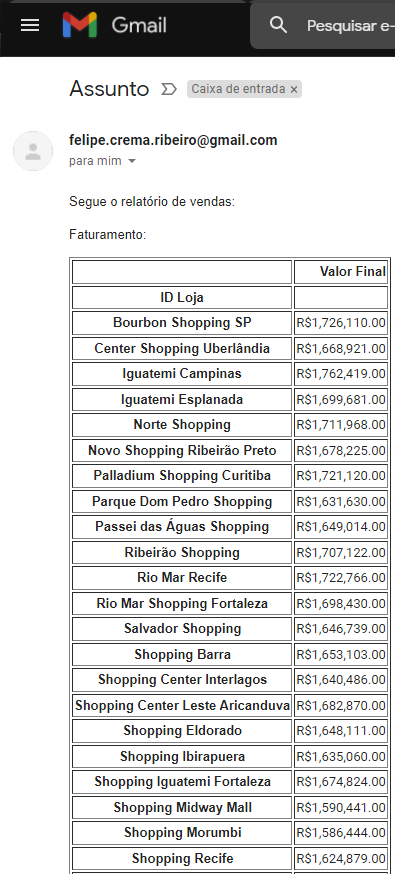
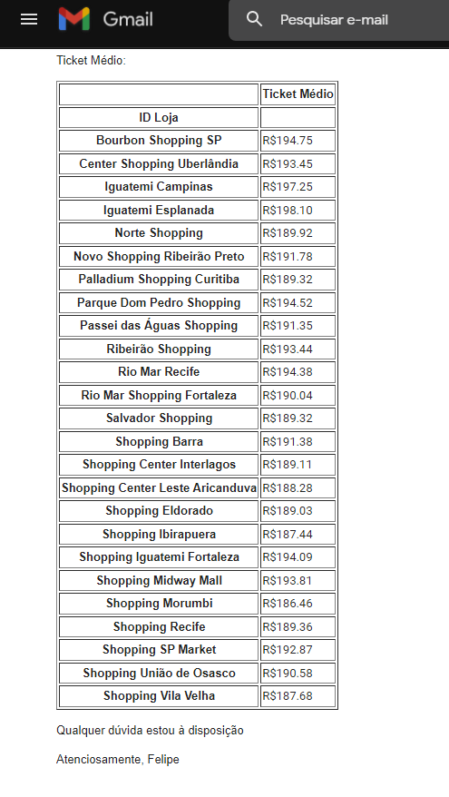

# Email And Report
## Sobre
 Este projeto consiste em um automatização do processo de gerar um relatório de vendas e enviá-lo por e-mail, com apenas o pressionar de um botão.
 
 Basicamente, o programa lê a base de dados(Arquivo Excel com + de 100 mil linhas), e gera 3 tabelas referentes às vendas dos Shoppings: A 1º é o faturamento total, a 2º são as unidades vendidas e a 3º é o ticket médio(preço médio por produto). Após isso, envia esse relatório por e-mail, conforme as imagens abaixo:
 
 

## Pré-requisitos
- Python
- Pandas
